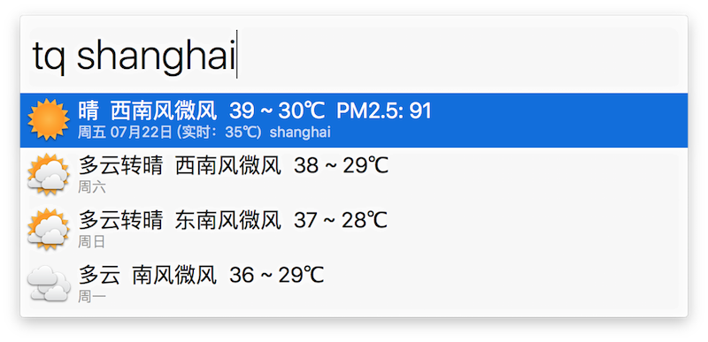

# ChinaWeather-workflow
An Alfred workflow that can search china weather.

### 说明

* 根据[@wensonsmith](https://github.com/wensonsmith)的[Baidu Weather](https://github.com/wensonsmith/weather-workflow)用 Ruby 2.0 重写创建
* 优化图标显示：
	- 大部分天气图标来自[橘色天气预报PNG图标 - 懒人图库](http://www.lanrentuku.com/png/1522.html)
	- 雾霾图标来自[SOFTICONS](http://www.softicons.com/web-icons/weather-icons-by-wojciech-grzanka/haze-icon)
	- 警告图标来自[25个感叹号警告PNG图标 - 懒人图库](http://www.lanrentuku.com/png/1638.html)
* 天气查询和查询IP所在城市的API来自[百度车联网](http://developer.baidu.com/map/carapi-7.htm)
* 可设置默认城市：在`Alfred Preferences`的`Workflows`页中选择`China weather`，双击右侧的`tq`Script Filter，取消注释行（删除 # 符号），然后用你希望的城市名替换`北京`。如果注释掉这行，会查询IP地址所在城市作为默认城市。

### 使用

* 从最新[Release](https://github.com/m2nlight/ChinaWeather-workflow/releases/latest)下载`China.weather.alfredworkflow`，双击或者用 Alfred 打开导入到 Workflows
* 在 Alfred 中输入 `tq` 会显示当前IP地址所在城市的天气情况（可在tq里修改成默认城市）
* 输入`tq 上海`或者`tq shanghai`可显示上海天气
* 在显示天气结果上按`return`，会复制天气信息到剪贴板
* 在查询失败结果上按`return`，会用默认的Web浏览器打开百度的搜索结果页面
* 在结果中按`command＋return`，会用默认的Web浏览器打开百度的搜索结果页面

### 调试

* 测试天气图标 输入`tq .晴`可显示晴天图标。 如果查询天气发现没有正确显示某些图标，可通过这种方式检验图标问题，最后请报告到这里。
